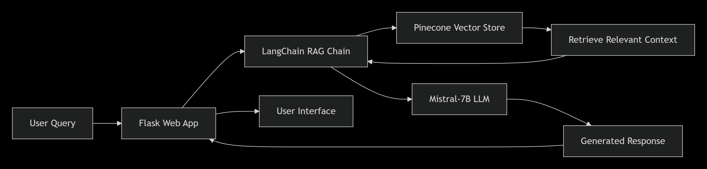

# Medical Chatbot with RAG & LLMs 🤖

A production-ready medical chatbot that leverages Retrieval-Augmented Generation (RAG) to provide accurate, context-aware responses using LangChain, Pinecone, and Hugging Face models. Deployed with full CI/CD pipeline on AWS.


## 📋 Table of Contents
- [Features](#features)
- [Architecture](#architecture)
- [Tech Stack](#tech-stack)
- [Installation](#installation)
- [Configuration](#configuration)
- [Usage](#usage)
- [CI/CD Deployment](#cicd-deployment)
- [Project Structure](#project-structure)
- [API Reference](#api-reference)
- [Environment Variables](#environment-variables)
- [Contributing](#contributing)
- [License](#license)

## ✨ Features

- **Retrieval-Augmented Generation (RAG)**: Combines document retrieval with LLM generation for accurate responses
- **PDF Document Processing**: Load and chunk medical PDF documents for vector storage
- **Pinecone Vector Database**: Efficient similarity search for relevant context retrieval
- **Hugging Face Integration**: Uses Mistral-7B-Instruct model for response generation
- **Modern Web Interface**: Clean, responsive chat UI with Bootstrap
- **Full CI/CD Pipeline**: Automated Docker builds and deployments to AWS EC2
- **Scalable Architecture**: Containerized with Docker for easy deployment

## 🏗️ Architecture




## 🛠️ Tech Stack

**Backend:**
- Python 3.10
- Flask 3.1.1
- LangChain 0.3.26
- Pinecone Vector Database
- Hugging Face Transformers

**Frontend:**
- HTML5/CSS3
- Bootstrap 4.1.1
- JavaScript/jQuery
- AJAX for async communication

**Infrastructure:**
- Docker for containerization
- AWS EC2 for hosting
- AWS ECR for Docker registry
- GitHub Actions for CI/CD
- Pinecone for vector database

## 📦 Installation

### Prerequisites
- Python 3.10+
- Pinecone API Key
- Hugging Face API Token
- AWS Account (for deployment)
- Docker (optional, for containerization)

### Local Development

1. **Clone the repository**
```bash
git clone https://github.com/duyilemi/med-llm-rag-chatbot.git
cd med-llm-rag-chatbot
```

2. **Create and activate virtual environment**
```bash
conda create -n medibot python=3.10 -y
conda activate medibot
```

3. **Install dependencies**
```bash
pip install -r requirements.txt
```

4. **Set up environment variables**
Create a `.env` file in the root directory:
```ini
PINECONE_API_KEY="your-pinecone-api-key"
HUGGINGFACEHUB_API_TOKEN="your-huggingface-token"
OPENAI_API_KEY="your-openai-api-key"  # If using OpenAI models
```

5. **Prepare data**
Place your medical PDF documents in the `data/` directory

6. **Create vector store**
```bash
python store_index.py
```

7. **Run the application**
```bash
python app.py
```

8. **Access the application**
Open your browser and navigate to `http://localhost:8080`

## ⚙️ Configuration

### Environment Variables
| Variable | Description | Required |
|----------|-------------|----------|
| `PINECONE_API_KEY` | Pinecone vector database API key | Yes |
| `HUGGINGFACEHUB_API_TOKEN` | Hugging Face API token for LLM access | Yes |
| `OPENAI_API_KEY` | OpenAI API key (if using OpenAI models) | Optional |
| `AWS_ACCESS_KEY_ID` | AWS access key for deployment | For deployment |
| `AWS_SECRET_ACCESS_KEY` | AWS secret key for deployment | For deployment |
| `AWS_DEFAULT_REGION` | AWS region for deployment | For deployment |

### Pinecone Index Configuration
- Index Name: `med-llm-rag-chatbot`
- Dimension: 384 (for `all-MiniLM-L6-v2` embeddings)
- Metric: Cosine Similarity
- Cloud: AWS
- Region: us-east-1

## 🚀 Usage

### Querying the Chatbot
1. Navigate to the web interface
2. Type your medical-related question in the chat input
3. Press send or hit enter
4. The chatbot will retrieve relevant context from stored documents and generate a response

### Example Queries
- "What are the symptoms of diabetes?"
- "Explain the treatment for hypertension"
- "What are the side effects of ibuprofen?"

### API Endpoints
- `GET /` - Main chat interface
- `POST /get` - Process user messages and return responses

## 🔄 CI/CD Deployment

### AWS Infrastructure Setup

1. **Create IAM User with permissions:**
   - `AmazonEC2ContainerRegistryFullAccess`
   - `AmazonEC2FullAccess`

2. **Create ECR Repository:**
```bash
aws ecr create-repository --repository-name medicalbot
```

3. **Create EC2 Instance:**
   - Ubuntu 22.04 LTS
   - Install Docker on EC2:
```bash
curl -fsSL https://get.docker.com -o get-docker.sh
sudo sh get-docker.sh
sudo usermod -aG docker ubuntu
newgrp docker
```

4. **Configure EC2 as Self-Hosted Runner:**
   - GitHub → Settings → Actions → Runners → New self-hosted runner

### GitHub Secrets Configuration
Add the following secrets in your GitHub repository settings:
- `AWS_ACCESS_KEY_ID`
- `AWS_SECRET_ACCESS_KEY`
- `AWS_DEFAULT_REGION`
- `ECR_REPO`
- `PINECONE_API_KEY`
- `OPENAI_API_KEY`

### Deployment Workflow
The CI/CD pipeline automatically:
1. Builds Docker image on push to main branch
2. Pushes image to AWS ECR
3. Deploys to EC2 instance
4. Runs the container with environment variables

## 📁 Project Structure

```
med-llm-rag-chatbot/
├── .github/workflows/
│   └── cicd.yaml          # GitHub Actions CI/CD pipeline
├── src/
│   ├── __init__.py
│   ├── helper.py          # Document loading, splitting, embeddings
│   └── prompt.py          # System prompts for LLM
├── static/
│   └── style.css          # Chat interface styling
├── templates/
│   └── chat.html          # Main chat interface
├── data/                  # Medical PDF documents (user-provided)
├── research/
│   └── trials.ipynb       # Experimental notebooks
├── app.py                 # Flask application
├── store_index.py         # Pinecone index creation and population
├── Dockerfile             # Docker configuration
├── requirements.txt       # Python dependencies
├── setup.py              # Package configuration
├── .env                  # Environment variables (template)
└── template.sh           # Project setup script
```

## 🔧 API Reference

### Helper Functions (`src/helper.py`)

#### `load_pdf_file(data)`
Loads PDF documents from a directory.

**Parameters:**
- `data` (str): Path to directory containing PDF files

**Returns:**
- List of Document objects

#### `text_split(extracted_data)`
Splits documents into text chunks.

**Parameters:**
- `extracted_data` (list): List of Document objects

**Returns:**
- List of text chunks

#### `download_hugging_face_embeddings()`
Downloads and returns Hugging Face embeddings.

**Returns:**
- HuggingFaceEmbeddings object

### Main Application (`app.py`)

#### Routes
- `@app.route("/")` - Renders main chat interface
- `@app.route("/get", methods=["GET", "POST"])` - Handles chat messages

#### RAG Chain Components
- **Retriever**: Pinecone vector similarity search (k=3)
- **LLM**: Mistral-7B-Instruct-v0.2 via Hugging Face
- **Prompt Template**: Medical assistant with context

## 🔒 Security Notes

- Never commit `.env` files with actual keys
- Use AWS IAM roles with least privilege principle
- Regularly rotate API keys and access tokens
- Monitor Pinecone usage and costs
- Ensure medical data compliance (HIPAA if applicable)

## 🤝 Contributing

1. Fork the repository
2. Create a feature branch (`git checkout -b feature/AmazingFeature`)
3. Commit changes (`git commit -m 'Add AmazingFeature'`)
4. Push to branch (`git push origin feature/AmazingFeature`)
5. Open a Pull Request

## 📄 License

This project is licensed under the MIT License - see the [LICENSE](LICENSE) file for details.

## 👥 Authors

- **Charles Duyilemi Olajide** - [charlieduyilemi@yahoo.com](mailto:charlieduyilemi@yahoo.com)

## 🙏 Acknowledgments

- [LangChain](https://www.langchain.com/) for the RAG framework
- [Hugging Face](https://huggingface.co/) for the LLM models
- [Pinecone](https://www.pinecone.io/) for vector database
- [Bootstrap](https://getbootstrap.com/) for UI components

## 📞 Support

For support, email charlieduyilemi@yahoo.com or create an issue in the GitHub repository.

---

**⚠️ Disclaimer:** This chatbot provides information for educational purposes only and is not a substitute for professional medical advice, diagnosis, or treatment. Always seek the advice of your physician or other qualified health provider with any questions you may have regarding a medical condition.